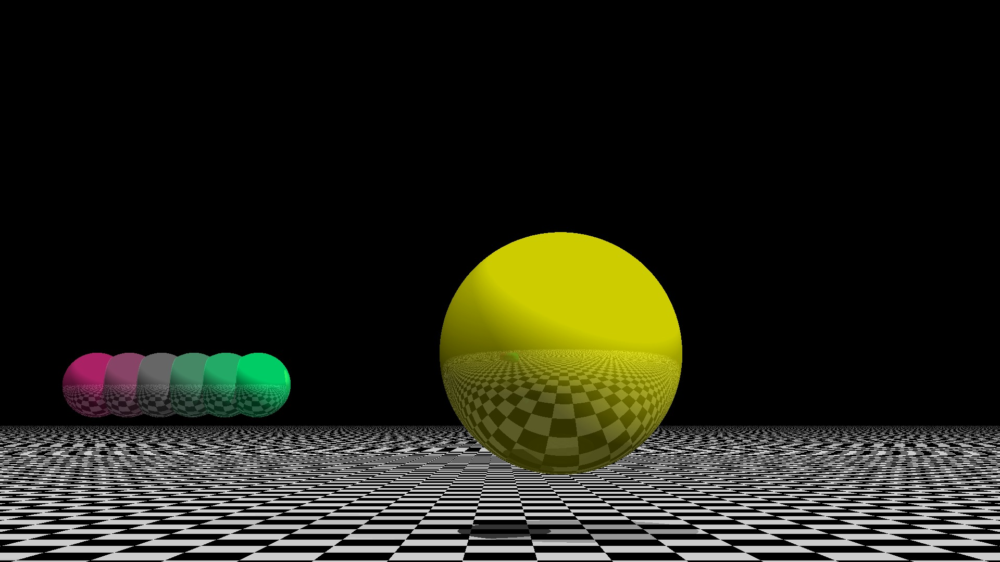

## Introduction

_premaxwell_ is my C++11 rewrite of the [toy ray tracer][1] originally written in 2008 (Python 2) by the Garnock-Jones brothers. The ray tracer has no refractions. For more complete ray tracers an interested reader is referred to ["smallpt" related codes](https://github.com/seifeddinedridi/smallvpt), Peter Shirley's et al. Ray Tracing Weekend Series, or even Physically Based Rendering: From Theory To Implementation by Matt Pharr, Wenzel Jakob, and Greg Humphreys.

Ray tracing is exciting as it follows nature, and one can simulate any non-wave phenomenon of light precisely, including soft shadows and caustics. On the other hand, the codes are often recursive and challenging to execute in parallel, and, above all, we can never bounce photons as many times as nature does. We cannot have as many photons to begin with.

Therefore, despite NVIDIA's RTX GPUs, I do not really believe in advances in this direction and appreciate real-time approximations which still capture a lot, but billions of times faster. The techniques like [shadow mapping and ray marching for volumetric light](https://github.com/aabbtree77/twinpeekz2) are closer to what the old masters did, and they present a much smarter way to model light.

This code, however, is about ray tracing. It serves only two purposes: 

- Presents my experiments with a minimal viable subset of C++11. This is subjective, I am mostly gaining some DX here. The code includes minimal uses of classes and polymorphism, but no compile-time gymnastics.

- Testing C++11 with gcc -O3 against PyPy (a jitted Python). The C++ code is not manually optimized, uses "fat pointers", the STL and lambdas, which I thought would lead to rapid code development with decent readability and performance (not really).

## Translation

The Python program creates heterogeneous containers at run-time. In order to emulate this type of programming, 
I have applied the STL vector of the C++11 shared pointers to the Base class from which all the geometric 
primitives are derived. This technique is known as "late binding" which uses virtual class functions and the public 
inheritance-based polymorphism. 

The ray-tracing recursions have been replaced here with a two-stage process: (i) path generation, 
and (ii) the propagation of colors. See the ray tracing result below, and compare it to the incorrect one [here.](https://pyperformance.readthedocs.io/)

<table>
<tr>
<th style="text-align:center"> Corrected Ray Tracing Result</th>
</tr>
<tr>
<td>

</td>
</tr>
</table>

## Setup Details

In order to compile the C++ code successfully, one must use the gcc-4.6.0 compiler (or a more recent version supporting C++11).
Simply run

```console
make
./premaxwell
```

It will create the image "out_cpp.ppm".

[To install PyPy](https://stackoverflow.com/questions/53266913/how-to-create-a-conda-environment-that-uses-pypy):

```console
conda config --set channel_priority strict
conda create -c conda-forge -n pypy pypy
conda activate pypy
```

Then simply run "python3 raytrace_mod.py" or [this one](https://unix.stackexchange.com/questions/375889/unix-command-to-tell-how-much-ram-was-used-during-program-runtime):

```console
/usr/bin/time --verbose  python3 raytrace_mod.py
```

to test the memory usage. "raytrace.py" is the original code that runs with Python 2, see also [Ref. 1][1].

## Some Minor Enhancements

The original Python code had a bug: its HalfSpace class did not calculate the intersection 
time correctly as it missed the necessary numerator, see [Ref. 2][2]. 

The second enhancement concerns the line 206 in the original code (raytrace.py):

__if candidateT is not None and candidateT > -EPSILON:__

It is better to change it to

__if candidateT is not None and candidateT > EPSILON:__

The execution time reduces 5x with no significant decrease of the quality.

## C++ vs. PyPy

In some ancient times I would run [Psyco](https://en.wikipedia.org/wiki/Psyco) which would speed up CPython roughly 3x, and in turn the C++ code would speed up the Psyco code further by 3x, reaching the overall 10x improvement. In the year 2021 the matters look different with PyPy:

CPython: __92.1s.__, 64.388 MB. 

C++11 (g++ -O3): __6.00s.__, 9.424 MB.

PyPy: __2.22s__, 114.224 MB.

Note: 1920x1080 resolution, intersection depth = 20, positive epsilon test. It is obvious that my C++ code could be made to run faster, the results merely indicate that this is not a trivial task. Also notice that PyPy speeds up CPython nearly 50x times in this case, so Python is not generally slow, it is that we are stuck with CPython and the C/C++ wrapping paradigm.

C++11 introduced shared_ptr, auto, range-based for loop, lambda, also std::thread which I did not exploit here. These new features, coupled with a judiciously used STL and POD would make a solid viable C++ subset. However, notice that this is not enough to get a superb performance exemplified with PyPy here. I managed to rewrite the Python code manually in C++ and make it run slower than the jitted Python 3 code by PyPy. I suspect this has something to do with the way I transformed recursion into a two stage iterative process, but in general the basic viable subset of C++ stated above does not guarantee anything unless you have a lot of time to further improve it. The PyPy program consumes 10x more RAM, but this is hardly a problem.

## JIT is Irrelevant

JIT and smart compilers are less important than the community with its libraries that solve real problems. PyPy and Julia remain pale in comparison to CPython which has attracted a lot of different people (not only compiler gurus):

- Travis Oliphant and Numpy, Anaconda, especially the latter.

- John D. Hunter (R.I.P.) and Matplotlib.

- PyTorch, Keras... Lots of unique ML models with some industrial effort there.

- William Stein and SageMath. 20KLOC just the graph library alone, Khovanov homology etc.

- ...

I would say the lib that made all the difference was **Matplotlib**. It was the primary reason Torch and Lua was abandoned in favor of PyTorch around 2010. I have also used Scilab and saw how advanced it was with PACA Grid in France 2012, yet when I had to publish the results, Scilab was lacking and my [plots](https://hal.archives-ouvertes.fr/hal-00723427) were made in Python.

I am pretty sure there will be a lot of code acrobatics to be found in Julia/C++/Rust eco systems, peta scale simulations what not, but to displace CPython one needs parity with Anaconda, Matplotlib, and PyTorch, at least. If you are not displacing CPython, you are only promoting n+1.

A quality package management that handles FFI to C/C++ with all the dependencies makes a huge difference. Notice that "pip3" is not "conda", it won't install correctly CUDA, Matplotlib with its GUI backends, and PyPy. I am able to run some modern convnets on my old GTX760 ("error: compute capability 3.0 not supported anymore") [without much hassle](https://github.com/aabbtree77/MNIST-0.17) only due to Anaconda.

## References

1. [https://github.com/python/pyperformance/tree/main/pyperformance/data-files/benchmarks/bm_raytrace][1]
2. [https://www.scratchapixel.com/lessons/3d-basic-rendering/minimal-ray-tracer-rendering-simple-shapes/ray-plane-and-ray-disk-intersection][2]

[1]: https://github.com/python/pyperformance/blob/main/pyperformance/benchmarks/bm_raytrace.py
[2]: https://www.scratchapixel.com/lessons/3d-basic-rendering/minimal-ray-tracer-rendering-simple-shapes/ray-plane-and-ray-disk-intersection
