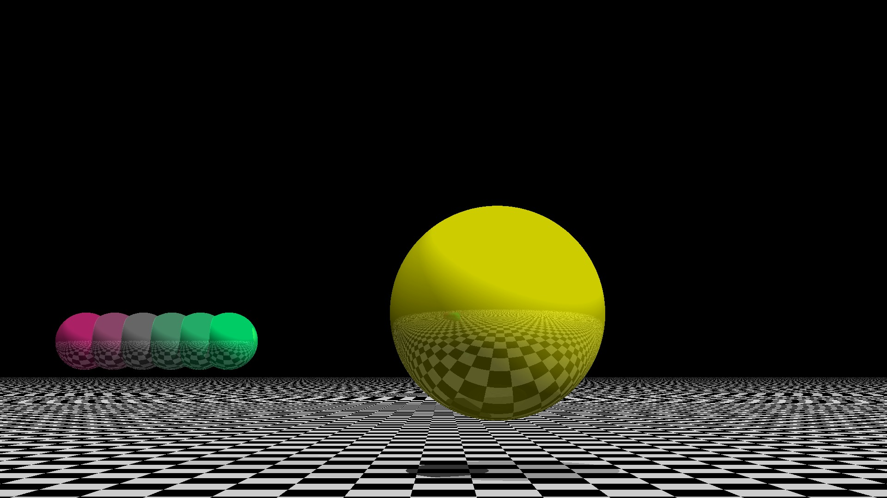

> Dedicated to John D. Hunter (1968 - 2012).

## Introduction

_premaxwell_ is my C++11 rewrite of the [toy ray tracer][1] originally written in 2008 (Python 2) by the Garnock-Jones brothers. The ray tracer has no refractions. For more complete ray tracers an interested reader is referred to ["smallpt" related codes](https://github.com/seifeddinedridi/smallvpt) or Peter Shirley et al. Ray Tracing Weekend Series. Ultimately, real time techniques like [shadow mapping and ray marching for volumetric light](https://github.com/aabbtree77/twinpeekz2) are closer to what the old masters did, and they will always be million times faster.

This code, however, is about ray tracing. It serves only two purposes: 

- Presents my experiments with a minimal viable subset of C++11.

- Tests C++11 with gcc -O3 against PyPy (a jitted Python).

## Translation

The ray-tracing recursions have been replaced here with a two-stage process: (i) path generation, 
and (ii) the propagation of colors. See the ray tracing result below, and compare it to the incorrect one [here.](https://pyperformance.readthedocs.io/)

<table>
<tr>
<th style="text-align:center"> Corrected Ray Tracing Result</th>
</tr>
<tr>
<td>

</td>
</tr>
</table>

## Setup Details

Use the gcc-4.6.0 compiler (or a more recent version supporting C++11).
Simply run

```console
make
./premaxwell
```

It will create the image file out_cpp.ppm.

[To install PyPy](https://stackoverflow.com/questions/53266913/how-to-create-a-conda-environment-that-uses-pypy):

```console
conda config --set channel_priority strict
conda create -c conda-forge -n pypy pypy
conda activate pypy
```

Then simply run "python3 raytrace_mod.py" or [this one](https://unix.stackexchange.com/questions/375889/unix-command-to-tell-how-much-ram-was-used-during-program-runtime):

```console
/usr/bin/time --verbose  python3 raytrace_mod.py
```

to test the memory usage. "raytrace.py" is the original code that runs with Python 2, see also [Ref. 1][1].

## Some Minor Enhancements

The original Python code had a bug: its HalfSpace class did not calculate the intersection 
time correctly as it missed the necessary numerator, see [Ref. 2][2]. 

The second enhancement concerns the line 206 in the original code (raytrace.py):

__if candidateT is not None and candidateT > -EPSILON:__

It is better to change it to

__if candidateT is not None and candidateT > EPSILON:__

The execution time reduces 5x with no significant decrease of the quality.

## C++ vs. PyPy

In some ancient times I would run [Psyco](https://en.wikipedia.org/wiki/Psyco) which would speed up CPython roughly 3x, and in turn the C++ code would speed up the Psyco code further by 3x, reaching the overall 10x improvement. In the year 2021 the matters already looked different with PyPy:

CPython: __92.1s.__, 64.388 MB. 

C++11 (g++ -O3): __6.00s.__, 9.424 MB.

PyPy: __2.22s__, 114.224 MB.

Note: 1920x1080 resolution, intersection depth = 20, positive epsilon test. It is obvious that my C++ code could be made to run faster, the results merely indicate that this is not a trivial task. PyPy speeds up CPython nearly 50x times in this case, so Python is not generally slow, it is that we are stuck with CPython and its ecosystem.

## Conclusions

* I have managed to rewrite the Python code manually in C++, and make it run slower than the Python3 code jitted by PyPy. The C++ code per se does not guarantee anything unless you have a lot of time to optimize it. 

* Loops are totally not a problem for Python, but the PyPy program consumes 10x more RAM. Also, the JIT technology is not relevant to simulations and numerical computing, sadly. PyPy and Julia remain pale in comparison to CPython which has Matplotlib, Anaconda, PyTorch, Keras, SageMath... The latter matter more than PyPy or even Python.

## Dedication

The lib that made all the difference for Python was **Matplotlib**, R.I.P. John D. Hunter (1968 - 2012). Matplotlib was the primary reason Torch and Lua were abandoned in favor of PyTorch around 2010. I had used Scilab and saw how advanced it was with PACA Grid in France 2012, yet when I had to publish my results, Scilab was lacking and [the plots](https://hal.archives-ouvertes.fr/hal-00723427) were made in Python with Matplotlib.

## References

1. [https://github.com/python/pyperformance/tree/main/pyperformance/data-files/benchmarks/bm_raytrace][1]
2. [https://www.scratchapixel.com/lessons/3d-basic-rendering/minimal-ray-tracer-rendering-simple-shapes/ray-plane-and-ray-disk-intersection][2]

[1]: https://github.com/python/pyperformance/tree/main/pyperformance/data-files/benchmarks/bm_raytrace
[2]: https://www.scratchapixel.com/lessons/3d-basic-rendering/minimal-ray-tracer-rendering-simple-shapes/ray-plane-and-ray-disk-intersection
